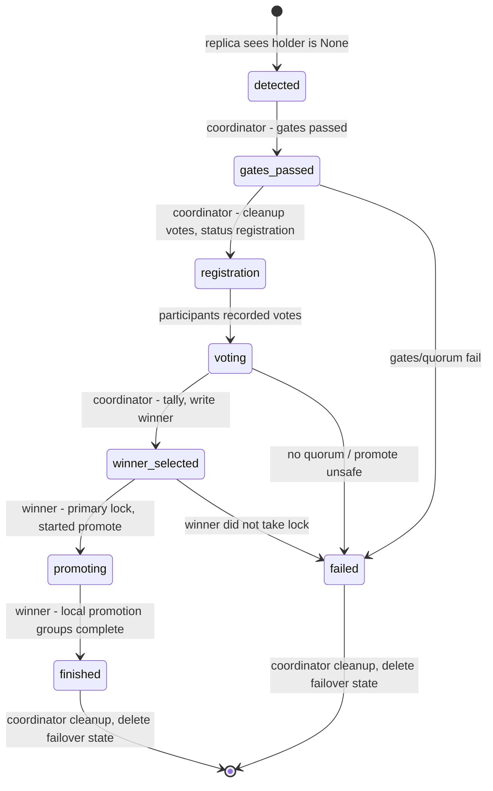

# ADR-0007: Failover State Machine — Coordinator + Participant over a Shared Command Plan

**Status:** Accepted
**Date:** 2026-08-13
**Deciders:** kopylov74
**Ticket:** MDB-41951 (Stage 6)

> **Amended by ADR-0008:** winner-local `creating_slots`, `promoting`, and
> `checkpointing` command groups are persisted on the winner filesystem.
>
> **Amended by ADR-0009:** failover is dispatched before role-based logic;
> `finished`/`failed` are blocking cleanup phases and cleanup removes
> `failover_state` instead of leaving `finished` as an idle value.

---

## Context

ADR-0005 introduced level-triggered reconciliation (an iteration is a pure function of
observed state), and ADR-0006 introduced the Functional Core / Imperative Shell pattern for
multi-step cluster operations: pure `plan(observation)` machines return a Command Plan that
a single [`CommandExecutor`](../src/command_executor.py) interprets. Switchover already
follows this model ([`src/switchover/`](../src/switchover/primary.py)):
`PrimarySwitchoverMachine` (the process manager) + `CandidateSwitchoverMachine`, with the
phase persisted to ZK (`switchover/state`) and the process resumable from any phase.

Failover was left outside this model and is structured differently:

- [`replica_iter`](../src/main.py) calls `_accept_failover` when `holder is None`.
- `_can_do_failover` is a monolithic set of gates (timeline sync,
  last-failover-timeout, primary-unreachable, promote-safe, disable walreceiver).
- `FailoverElection.make_election` runs distributed elections with a blocking
  `time.sleep(timeout/2)` and `await_for` **inside a single iteration**.
- The winner proceeds via `_do_failover` → [`_promote`](../src/main.py); losers
  return to the cluster on their own.

The core problem: `FailoverElection` elects an **election manager** — a temporary
coordinator **only for the voting stage** (via `ELECTION_MANAGER_LOCK_PATH`). After the
election the coordinator "dissolves": there is no manager for the failover process as a
whole. The entire path is "one-shot": blocking waits inside the iteration, progress is
not persisted per phase, and an interruption (OS signal, ZK timeout) means the process
cannot resume from the same point. This is the same class of non-idempotency that
ADR-0005 eliminated for switchover.

> **Note:** `failover_election.py`, `_accept_failover`, and `_can_do_failover` were
> removed in this PR — their logic is unfolded into the coordinator/participant phases
> (see §1–§2). The references above describe the **pre-refactor** structure that this
> ADR replaces.

Failover also has a nature different from switchover: **the primary is dead, so there is no
pre-known coordinator** — the coordinator must be elected via a lock. Therefore a "process
manager" does not remove the distributed second side: the coordinator collects votes, and
participants vote and (the winner) promote.

## Decision

Move failover onto the ADR-0006 model (Functional Core / Imperative Shell) with a **manager
for the whole process** — variant **A1** (elections decomposed into explicit phases).

### 1. Two pure machines (new package `src/failover/`)

```
src/failover/
├── __init__.py       # re-export public API
├── types.py          # FailoverPhase, FailoverRecord, FailoverObservation, FailoverMachineConfig
├── coordinator.py    # FailoverCoordinatorMachine
└── participant.py    # FailoverParticipantMachine
```

- **`FailoverCoordinatorMachine`** — the node holding `ELECTION_MANAGER_LOCK_PATH` (the
  existing lock is reused; no new node is introduced). Drives the phases: gate checks,
  registration, selection, writing the winner.
- **`FailoverParticipantMachine`** — every HA replica: votes; if it is the winner, acquires
  the primary lock and promotes; if a loser, delegates to
  [`ReturnToClusterMachine`](../src/return_to_cluster/machine.py).
- Both are pure `plan(observation)` with no I/O; they depend only on `types` and
  `..commands`.

### 2. Phase persisted in the extended `failover_state` node

The cross-host values are `detected`, `walreceiver_disabling`, `gates_passed`,
`registration`, `voting`, `winner_selected`, `promoting`, `finished`, and
`failed`. Internal winner progress is local according to ADR-0008.



Elections are **decomposed into phases**: the `sleep(timeout/2)` and
`await_for` inside `FailoverElection.make_election` are removed; waiting for votes and for
the winner lock to appear is expressed as separate iterations, with the condition checked
in the Observation. `failover_election.py` is removed in this PR — its logic is unfolded
into the coordinator/participant phases (see §1–§2).

### 3. FailoverObservation — the sole `plan()` input

An immutable `@dataclass(frozen=True)` assembled once in a builder (analog of
[`SwitchoverObservation.build`](../src/switchover/types.py)). It carries: `record`
(phase + winner + votes), `my_hostname`, `role`/`fallback_role`, `lock_holder`,
`is_coordinator` (whether `ELECTION_MANAGER_LOCK_PATH` is held), `election_status`,
`election_winner`, `votes`, `ha_replics`/`alive_hosts`, `replics_info`, `host_lsn`,
`host_priority`, timeout fields, `is_primary_unreachable`, `is_replaying_wal`,
`switchover_in_progress`, and timer-started flags. All gates of the former
`_can_do_failover` become **pure predicates** over the Observation; I/O side effects
(`disable_wal_receiver`, `is_host_unreachable`) run in the builder or via commands.

### 4. Shared CommandExecutor + vocabulary extension

Failover machines are executed by the same [`CommandExecutor`](../src/command_executor.py)
(ADR-0006 §5). The existing promotion pipeline is reused, and the following
commands are added: `WriteLastFailoverTime`, `CleanupVotes`, `WriteElectionStatus`,
`WriteElectionVote`, `WriteElectionWinner`, `ResetFailoverNode`, plus a failover variant of
`TransitionTo` (writes `failover_state`). Each command gets a dispatch branch and a unit
test; the vocabulary is kept minimal.

### 5. Entry point in `main.py`

`run_iteration()` calls `handle_failover()` before role-based dispatch. The
handler builds a `FailoverObservation` and delegates one step: if the node
holds `ELECTION_MANAGER_LOCK_PATH`, the coordinator runs; otherwise the
participant runs. Existing switchover→failover fallback paths are detected by
the same top-level handler and use a `switchover_in_progress` flag. This flag
**skips two gates** in `plan_detected` (`_gates_pass`): the `autofailover` gate
(`autofailover or switchover_in_progress`) and the primary-unreachable (libpq) gate
(`not switchover_in_progress and not is_primary_unreachable`). The skip is necessary
because a failed switchover means the primary is still alive (reachable via libpq) but
must be replaced anyway — see `src/failover/coordinator.py` (`_gates_pass`).

### 6. Safety

- The **race-validated ordering** from `FailoverElection.make_election` is preserved when
  moving it into phases: elect a winner, acquire the leader lock, then promote.
- **ADR-0002 I/O boundary**: the single place handling `PostgresConnectionError` /
  `ZookeeperException` is `CommandExecutor`; DB loss during promote → fail-fast → release
  lock.
- **Debug hooks per phase** (`_debug_failure`) on every transition — for behave kill-9.

## Alternatives

### A1. Coordinator + Participant, elections decomposed into explicit phases — chosen

Symmetry with switchover: `FailoverCoordinatorMachine` (analog of
`PrimarySwitchoverMachine`) + `FailoverParticipantMachine` (analog of
`CandidateSwitchoverMachine`). Election phases (`registration → voting → winner_selected`)
are persisted to ZK; the blocking `sleep(timeout/2)` is replaced by "no condition → empty
Plan → retry next iteration". Full resume, including the voting stage.
Downside: touches the most dangerous distributed election code.

### A2. Coordinator + Participant, elections as an opaque `MakeElection`

Machines are introduced, but elections remain a single opaque command (`MakeElection` is
already stubbed in [`commands.py`](../src/commands.py)) delegating to the current
`FailoverElection`. Faster and safer, but elections are **not** resumable — the idempotency
goal is only partially met.
Rejected as the end goal (acceptable as an intermediate implementation stage).

### A3. Fully distributed `FailoverMachine` with no designated manager

Every replica runs its own machine; coordination is purely via ZK primitives with no
coordinator role. Closer to bully/raft, but this rewrites the race-validated protocol of
`FailoverElection.make_election` with a high split-brain risk.
Rejected.

### A4. Keep `FailoverElection`, wrap only `_do_failover` in a machine

Minimal intervention: a machine only around promote/finalize, elections untouched.
Does not solve the main problem (blocking elections inside the iteration remain).
Rejected.

## Consequences

**Positive:**

- Failover becomes **resumable from any phase** (the MDB-41951 goal), including the
  election stage; blocking `sleep`/`await_for` inside the iteration are eliminated.
- An **explicit manager for the whole process** (`FailoverCoordinatorMachine`) appears,
  rather than only for the election stage.
- Machines are **pure and mock-free**: tests assert on the Plan composition, not on
  interactions (as in switchover).
- **Infrastructure reuse**: the same `CommandExecutor`, the same I/O boundary, a shared
  command vocabulary; the loser branch delegates to the ready-made `ReturnToClusterMachine`.
- A single pattern for switchover/failover/return-to-cluster simplifies maintenance.

**Negative / Risks:**

- The **most dangerous code** in the system is touched (promote, split-brain and data-loss
  risk). A full behave suite is required, including kill-9 per phase, plus a two-phase
  rollout.
- Decomposing distributed elections into phases is a high-risk refactor; the operation
  ordering must be transferred verbatim.
- The growth of `failover_state` values and commands means the DSL must be kept minimal.

**Neutral:**

- During intermediate implementation stages, `Promote`/`MakeElection` may temporarily stay
  opaque (delegating to current methods), to be unfolded into phases later — this affects
  the stage ordering but not the final architecture.
- `failover_election.py` is removed in this PR — its logic is unfolded into the
  coordinator/participant phases.

## Links

- ADR-0002: Exception Propagation — the single I/O boundary for failover commands.
- ADR-0004: Factory + Config-Builder — `FailoverMachineConfig` and the Observation builder.
- ADR-0005: Idempotent Iterations — the level-triggered model this ADR extends to failover.
- ADR-0006: Cluster-Op State Machines (Functional Core / Imperative Shell) — the machine
  pattern and shared `CommandExecutor` reused here.
- Implementation plan: `10-projects/pgconsul/MDB-41951-idempotency-algo/implement/53-failover-state-machine-plan.md`
- Reference: [`src/switchover/`](../src/switchover/primary.py),
  [`src/return_to_cluster/`](../src/return_to_cluster/machine.py).
