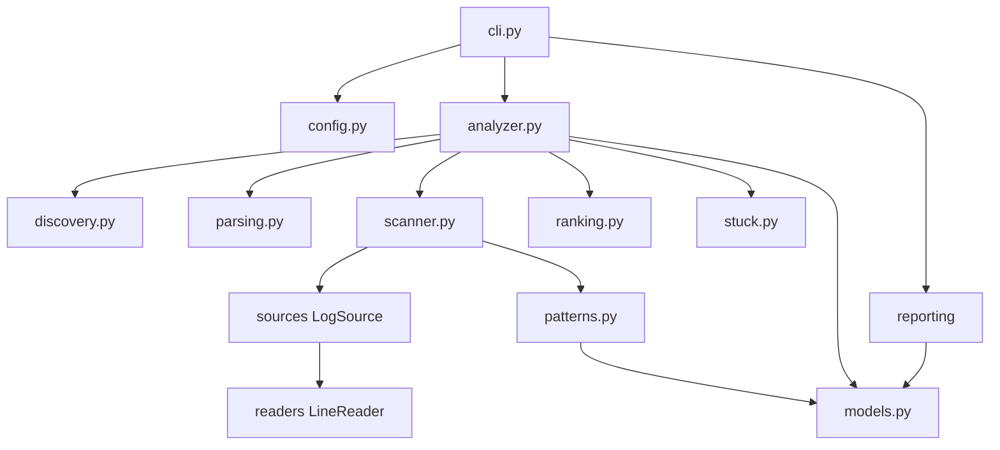
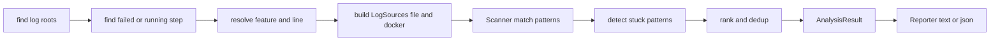

# failure_analyzer

Analyze failed [behave](https://github.com/behave/behave) test logs and pinpoint the root cause.

`failure_analyzer` automates the diagnostic workflow for pgconsul integration tests:

1. Find the failed step in `test_execution.log` (or detect a still-running step).
2. Identify the feature file, line number, and container logs.
3. Scan container logs for known failure patterns.
4. Produce a concise summary with the most likely root cause.

It replaces a single ~1050-line monolithic script with a layered, testable package.

---

## Quick start

```bash
# Auto-discover the latest test logs (logs/ or logs.local/)
python scripts/analyze_failed_scenario.py

# Point at a specific log directory
python scripts/analyze_failed_scenario.py logs.local/logs-failover_with_network_inconsistency

# Also scan a second log tree (e.g. logs.local/2/logs)
python scripts/analyze_failed_scenario.py logs.local/logs-failover_with_network_inconsistency logs.local/2/logs

# Machine-readable JSON for CI
python scripts/analyze_failed_scenario.py --format json

# Run the test suite
python -m pytest scripts/failure_analyzer/tests/ -q
```

The entry point `scripts/analyze_failed_scenario.py` is a thin shim that delegates
to `failure_analyzer.cli:main`. The CLI is backward compatible with the original
script.

---

## CLI reference

```
usage: analyze_failed_scenario.py [-h] [--verbose] [--docker] [--no-docker]
                                  [--format {text,json}] [--no-grep]
                                  [log_dirs ...]
```

| Option | Description |
| --- | --- |
| `log_dirs` | Log directories to search (default: auto-discover `logs/` and `logs.local/`). |
| `--verbose`, `-v` | Show all findings, not just the top 15. |
| `--docker` | Also scan live docker containers. Enabled automatically when no saved container logs are found. |
| `--no-docker` | Disable docker container scanning (overrides auto-detect). |
| `--format {text,json}` | Output format (default: `text`). `json` is intended for CI. |
| `--no-grep` | Use a pure-Python reader instead of the external `grep` binary (portable, slower). |

### Output streams

- **stdout** — the report (text or JSON). Safe to pipe/parse.
- **stderr** — informational messages and `logging` warnings (e.g. unreadable
  files, docker failures). This keeps stdout pure for CI consumers.

### JSON output shape

```json
{
  "failed_step": { "step": "...", "timestamp": "...", "duration": 30.5, "feature_file": "...", "line_number": 10 },
  "running_step": null,
  "log_file": "logs/debug/test_execution.log",
  "container_logs": [ { "container": "...", "log_type": "pgconsul", "path": "..." } ],
  "findings": [ { "container": "...", "log_type": "pgconsul", "pattern": "...", "weight": 100, "line_no": 42, "timestamp": "...", "line": "..." } ],
  "docker_findings": [],
  "stuck_indicators": ["  [c/pgconsul] ...: 6 occurrences (...)"],
  "likely_root_cause": { "pattern": "...", "container": "...", "evidence": "..." }
}
```

---

## Architecture

The package is split into modules with a single responsibility each. Dependencies
flow inward: the CLI wires collaborators together (dependency injection), the
`Analyzer` orchestrates the pipeline, and the `Scanner` depends only on the
`LogSource` abstraction.

```
failure_analyzer/
  __init__.py
  models.py          # dataclasses: FailedStep, RunningStep, ContainerLog, Finding, AnalysisResult
  patterns.py        # dataclass Pattern (precompiled regex) + pattern sets
  config.py          # Config dataclass — all tunables in one place
  utils.py           # shared helpers: timestamp, dedup, container-name, logging, size
  parsing.py         # parse_failed_steps, parse_running_step (pure functions)
  discovery.py       # find log roots, test_execution.log files, feature/line, container logs
  scanner.py         # Scanner — single matching engine over LogSource
  ranking.py         # rank + deduplicate findings
  stuck.py           # stuck/looping pattern detection
  docker.py          # docker integration behind a DockerRunner protocol
  analyzer.py        # Analyzer — orchestrates the pipeline, builds AnalysisResult
  reporting/
    base.py          # Reporter ABC
    text_reporter.py # TextReporter (human-readable, backward compatible)
    json_reporter.py # JsonReporter (for CI)
  sources/
    base.py          # LogSource ABC
    file_source.py   # FileLogSource
    docker_source.py # DockerLogSource
    readers.py       # LineReader: GrepReader + PurePythonReader
  tests/             # unit tests (pytest)
  cli.py             # argparse + DI assembly + entry point
```

### Module dependency graph



### Analysis pipeline



---

## Key design decisions

### `LogSource` (Strategy)

A `LogSource` yields a stream of `(line_no, line)` pairs and knows its container
name and log type. The `Scanner` depends only on this interface, so files-on-disk
and live-docker-containers are interchangeable. This removes the duplicated
scanning loops (`scan_log_file` for files and `scan_docker_containers` for
containers) that existed in the original script.

### `Pattern` with precompiled regex

Patterns are declared as `(regex, name, weight)` tuples and compiled **once** at
import time into immutable `Pattern` objects. The compiled regex is reused on
every scanned line, eliminating the per-line `re.compile` cost of the original
implementation. `Finding` holds a reference to the `Pattern`, so it carries its
own weight — no fragile string-keyed `weight_map` lookup.

### `LineReader` with a Python fallback

Reading a 180 MB `postgresql.log` line-by-line in Python is slow. `GrepReader`
shells out to `grep -n -E` to pre-filter DEBUG lines in one pass (the original
behavior). `PurePythonReader` is a portable fallback, selected with `--no-grep`.
If `grep` is unavailable at runtime, `GrepReader` falls back to a full read
automatically.

### Dependency injection

`cli.py` assembles `Config`, `Scanner`, `LineReader`, and `Reporter` and passes
them to the `Analyzer`. The analyzer creates no dependencies itself, which makes
it unit-testable without filesystem or subprocess access. `DockerLogSource`
takes a `DockerRunner` protocol, so tests inject a fake runner instead of
requiring docker.

### Separation of analysis and presentation

The `Analyzer` builds a pure `AnalysisResult` and performs no I/O of its own.
`Reporter` implementations render it: `TextReporter` reproduces the original
human-readable output (a regression guard), and `JsonReporter` emits a stable
JSON document for CI.

### Logging instead of silent `except`

The original script swallowed exceptions with `except Exception: return []`
and no logging — a diagnostic tool that silently finds nothing is dangerous.
Failures (unreadable files, docker errors, missing `grep`) are now logged at
`WARNING` level to stderr.

---

## Pattern sets

Patterns are grouped by log type and ordered by diagnostic priority. Higher
`weight` means "more likely to be the root cause".

| Set | Applied to | Purpose |
| --- | --- | --- |
| `PGCONSUL_PATTERNS` | `pgconsul.log` | pgconsul HA/failover/switchover errors |
| `POSTGRES_PATTERNS` | `postgresql.log` | PostgreSQL WAL/replication/recovery errors |
| `ZOOKEEPER_PATTERNS` | `zookeeper.log` | ZooKeeper session/connection errors |
| `STUCK_PATTERNS` | `pgconsul.log`, `postgresql.log` | Repeated/looping behavior leading to timeout |

Stuck patterns are reported when a pattern fires at least
`Config.stuck_min_occurrences` (default: 5) times, with the time span of the
occurrences.

To add a pattern, append a `(regex, name, weight)` tuple to the relevant
`_*_RAW` list in [`patterns.py`](patterns.py). Names must be unique within a
single set (an `assert` guards this at import time).

---

## Configuration

All tunables live in [`Config`](config.py). The CLI builds a `Config` from
arguments; tests construct one directly. Notable fields:

| Field | Default | Meaning |
| --- | --- | --- |
| `max_full_read_size` | 50 MB | Files above this are grep-prefiltered. |
| `docker_tail_lines` | 5000 | Lines tailed from docker container logs. |
| `default_findings_limit` | 15 | Findings shown in non-verbose text output. |
| `stuck_min_occurrences` | 5 | Matches needed to report a stuck pattern. |
| `docker_project` | `pgconsul` | docker-compose project name. |
| `use_grep` | `True` | Use the external `grep` binary for large files. |
| `auto_discover_roots` | `logs`, `logs.local` | Roots searched when none are given. |

---

## Testing

Tests live in [`tests/`](tests/) and use `pytest`. A `conftest.py` puts the
`scripts/` directory on `sys.path` so `import failure_analyzer` works when
running pytest from the repo root.

```bash
python -m pytest scripts/failure_analyzer/tests/ -q
```

Coverage:

- `test_parsing.py` — failed/running step extraction from `test_execution.log`.
- `test_scanner.py` — pattern matching over a fake `LogSource`, truncation,
  multi-source dispatch, docker findings.
- `test_ranking.py` — ranking, deduplication, `limit`, and `utils` helpers.
- `test_sources.py` — `FileLogSource` and `DockerLogSource` (with a fake runner),
  DEBUG filtering, missing files.
- `test_discovery.py` — log root discovery, feature/line resolution, container
  log walking.
- `test_reporting.py` — `TextReporter` sections and `JsonReporter` validity.

Docker is never required in tests: `DockerLogSource` takes an injected
`DockerRunner`, and `docker.py` functions are thin wrappers tested indirectly.

---

## Extending

- **New failure pattern** — add a tuple to the relevant set in `patterns.py`.
- **New log type** — add patterns to `PATTERNS_BY_LOG_TYPE` in `patterns.py`;
  discovery already normalizes log file stems to log types.
- **New output format** — subclass `Reporter` and wire it in `cli.make_reporter`.
- **New log source** — implement `LogSource` and build instances in the CLI/analyzer.

---

## Migration notes

The original `scripts/analyze_failed_scenario.py` is now a shim that imports
`failure_analyzer.cli:main`. Existing invocations, CI pipelines, and references
in `AGENTS.md` keep working unchanged. New options (`--format`, `--no-grep`) are
additive.
